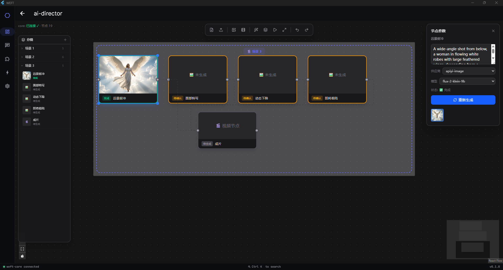

# Weft

**English** · [简体中文](docs/README.zh-CN.md)

**A modular AI agent platform.** A Rust core runtime exposes an
OpenAI-compatible API and a capability-based plugin system; behavior is extended
by WASM and native **packages**; and a cross-platform Flutter desktop client
drives it all — multi-agent team orchestration, persistent memory, tool use,
skills, an AI video-editing canvas, and an AI-augmented RSS reader.

```
Flutter desktop client  ⇄  weft-core (Rust, OpenAI-compatible API)  ⇄  packages (WASM / native)
```


> [!WARNING]
> **Weft is early, in active development, and not yet stable.** It is mid-way
> through a packaging overhaul. APIs (the HTTP endpoints, the
> capability contracts, and `packages/index.toml`) can and will change without
> notice, some packages are experimental, and you should expect rough edges.
> Treat this as a preview for exploration, not a production dependency.

---

## Download

The fastest way to try Weft is a prebuilt desktop bundle from the
[**Releases**](https://github.com/ailiheizi/weft/releases) page — it includes the
client and the `weft-core` sidecar, so it launches and runs without a separate
install or a build toolchain. Add an AI provider on first run and you're ready.

Prefer to build from source? See [Build](#build).

---

## Table of contents

- [Highlights](#highlights)
- [Download](#download)
- [Feature showcase](#feature-showcase)
- [Architecture](#architecture)
- [The capability system](#the-capability-system)
- [Official packages](#official-packages)
- [Repository layout](#repository-layout)
- [Build](#build)
- [Run](#run)
- [Configuration](#configuration)
- [Documentation](#documentation)
- [Continuous integration](#continuous-integration)
- [About](#about)
- [License](#license)

---

## Highlights

- **One API, many providers.** The core speaks the OpenAI-compatible protocol
  (`/v1/chat/completions`) and routes to OpenAI, Anthropic, DeepSeek, OpenRouter
  and any compatible endpoint, with API-key failover/rotation and pluggable
  routing.
- **Multi-agent teams.** A workflow orchestrator turns one goal into a
  `depends_on` DAG of parallel sub-tasks, delegates them to role-based agents
  (planner, executor, reviewer…), and streams each agent's output back live.
- **Tools, used automatically.** Built-in shell, file, web, git, and browser
  tools are offered to the model through a uniform contract. A semantic
  `tool-selector` (ONNX INT8 cosine-similarity matching, ~5–50 ms per query, no
  GPU) helps route to the right tool mid-turn without manual wiring.
- **Persistent memory & proactive context.** A curated memory runtime keeps
  context across sessions; a context engine ingests signals and suggests
  relevant skills.
- **Extensible by design.** Everything beyond raw LLM routing is a **package**
  (WASM, native, or embedded). Load skills, register
  [MCP](https://modelcontextprotocol.io/) servers, run JS extensions, schedule
  cron jobs.
- **More than a chat client.** Beyond agents, Weft ships an AI-augmented RSS
  reader, an AI video-editing canvas (`ai-director`), and an embedded workspace
  browser — all as packages on the same runtime.
- **Products on top.** `weft-claw` (multi-role AI dev assistant) and
  `ai-director` (style-learning AI video editor) are assembled declaratively
  from the same runtime.

---

## Feature showcase

The desktop client is organized as an app shell with a left navigation rail.
Every feature below is real and maps to a screen or a package-delivered app
surface. For the full walkthrough see **[docs/FEATURES.md](docs/FEATURES.md)**.

### Chat with automatic tool selection

Streaming, multi-session chat that renders Markdown and produces artifacts —
and selects the right tool (shell / files / web / git) for each turn on its own.
Tool calls render as purpose-built bubbles (a shell bubble, a file bubble, a
web-search bubble) instead of raw JSON, and MCP tools (`mcp:server:tool`) get
the same treatment.

### Tool selector

See and control exactly which tools a turn can reach. Routing is backed by the
`tool-selector` package — a semantic selector that ranks candidate tools by
cosine similarity using local ONNX INT8 inference (a few milliseconds per query,
no GPU). Add more tools by installing packages or registering MCP servers.

### AI-augmented RSS reader

A feed reader with a dedicated papers view, **inline translation** of any
article, and **select-to-ask-AI** — highlight a passage and ask the AI to
explain or summarize it without leaving the reader.


### Package manager

Browse installed packages, install from a remote source, import from disk,
configure per-package settings, and enable/disable — all without rebuilding.


### Resident service manager

Start, stop, and restart the long-lived services (memory runtime, context
engine, browser surface…) that power the always-on parts of Weft.

### Weft Claw — multi-role AI dev assistant

A coding assistant assembled from the same runtime: describe what you want, and
it selects tools, writes code, and runs the tests on its own — surfacing each
step instead of a black box. It's a product declaratively composed from Weft's
agent, tool, and runtime capabilities, not a separate codebase.

### AI Director — the AI canvas

A style-learning AI video editor, presented as an **infinite canvas**. Instead
of a linear timeline, the Director lays work out as an AI-generated node graph
(a DAG of scenes and shots) you can pan and zoom — another product grown from
the same runtime, proving the "one architecture, many products" claim.



> **Multi-agent orchestration** is covered in full detail in
> [docs/FEATURES.md](docs/FEATURES.md).

---

## Architecture

Weft has three layers: the **client**, the **core runtime**, and the
**packages** the core loads.

```
┌─────────────────────────────┐
│  weft_client (Flutter)       │   Windows / macOS / Linux desktop UI
│  chat · teams · DAG view ·   │
│  apps · packages · config    │
└──────────────┬──────────────┘
               │  HTTP  (OpenAI-compatible + management API)
               │  127.0.0.1:17830  (loopback, token-guarded)
┌──────────────▼──────────────┐
│  weft-core (Rust service)    │
│                              │
│  • OpenAI-compatible API     │  /v1/chat/completions, /v1/models
│  • Management API            │  /api/apps, /api/capabilities, /api/packages…
│  • Provider router           │  multi-provider + key failover/rotation
│  • Capability registry       │  binds capability ids → providers
│  • Package loader (Extism)   │  loads WASM + native packages
│  • Pipeline                  │  request → transform → provider → response
└──────────────┬──────────────┘
               │  capability calls
┌──────────────▼──────────────┐
│  Packages                    │
│  agent-runtime · memory ·    │  WASM (Extism) or native, declared in
│  tools · skills · mcp ·      │  packages/index.toml (the source authority)
│  workflow · team-runtime …   │
└─────────────────────────────┘
```

**Client ⇄ core** is process-to-process over a loopback HTTP API, so the same
core can serve the desktop client, scripts, or any OpenAI-compatible tool. The
core loads capability packages at runtime rather than compiling them in.

Full deep dive: **[docs/ARCHITECTURE.md](docs/ARCHITECTURE.md)**.

---

## The capability system

Everything the core can *do* beyond raw LLM routing is modeled as a
**capability** — a stable string id (e.g. `agent.runtime`, `memory.store`,
`tool.shell`, `workflow.orchestration`) that a package *provides* and that apps
*require*. `packages/index.toml` is the **source authority**: it maps each
capability to the package that provides it, the package kind (`provider` /
`product` / `foundation`), and its runtime (`wasm` / `native` / `embedded` /
`service`).

At startup the core builds a capability registry, resolves each app's required
capabilities to concrete providers (`bindings`), and dispatches capability calls
to the right package. This is what lets products like `weft-claw` be assembled
declaratively from agent-runtime + memory + tools + skills without hard-coding
any of them.

---

## Official packages

The 31 packages under `packages/official/` group into a few families. See the
[capabilities reference](docs/FEATURES.md#capabilities-reference) for the full
provides/requires table.

**Agent & orchestration**
| Package | Provides | Role |
|---|---|---|
| `agent-core` | `agent.runtime`, `team.delegate` | Agent turns, session-aware dialog, tool dispatch |
| `workflow-orchestrator` | `workflow.orchestration` | Task proposal, verification, DAG step orchestration |
| `team-runtime` | `team.runtime`, `team.role.catalog`, `team.context.shared` | Team roles, shared context, delegate routing |
| `team-task-board` | `team.taskboard`, `team.handoff` | Task board + cross-role handoff |
| `generic-agent-runtime` | `generic_agent.plan/run/verify/crystallize` | Experimental self-evolving task runtime |
| `workflow-template-devteam`, `workflow-template-creative` | workflow templates | Prebuilt team/creative workflows |

**Memory & context**
| Package | Provides | Role |
|---|---|---|
| `memory` / `memory-runtime` | `memory.store`, `memory.runtime`, `memory.curated` | Persistent curated memory |
| `context-engine` | `context.engine`, `context.ingest`, `context.match` | Ingests signals, suggests skills |
| `prompt-system` | `prompt.system` | System-prompt management |
| `session-events` | `session.events` | Session lifecycle events |

**Tools & extension**
| Package | Provides | Role |
|---|---|---|
| `tool-runtime-core` | `tool.runtime` | Uniform tool dispatch contract |
| `tool-shell` / `tool-files` / `tool-web` / `tool-git` | `tool.shell/files/web/git` | Built-in tools |
| `tool-selector` | `tool.selector` | Semantic tool routing (ONNX INT8, local) |
| `tool-browser` | `tool.browser` | Browser automation via chrome-devtools-mcp |
| `skills` | `ext.skills`, `skills.evolution/governance/review/maintenance` | Skill discovery, loading, execution |
| `mcp-client` | `ext.mcp` | Register MCP servers, expose their tools |
| `js-extension-runtime` | `extension.runtime.js`, `skill.discovery` | Run JavaScript extensions |
| `channels` | `channel.bridge` | Channel bridge & routing |
| `cron` | `scheduler.cron`, `maintenance.tick` | Scheduled jobs |

**Products & media**
| Package | Role |
|---|---|
| `weft-claw` | Multi-role AI development assistant (product) |
| `ai-director` | Style-learning AI video-editing assistant (product) |
| `rss-reader` | AI-augmented RSS/Atom reader (subscribe, summarize, recommend) |
| `ffmpeg-runtime`, `image-gen` | Media: ffmpeg runtime, image generation |
| `ai-workspace-browser`, `creative-role-catalog` | Workspace browser, creative role catalog |

> Capabilities the **core itself** provides (not a package) include
> `core.execution` (command execution, dry-run gated) and `core.files`
> (workspace file access).

---

## Repository layout

```
core/                 Rust core runtime (weft-core, weft, weft-sign, weft-rpc)
crates/               Supporting crates (weft-code-runtime)
packages/
  sdk/                Shared package SDK (path dependency for all packages)
  official/           The 31 official packages
  installed/          Installed package metadata (manifests; wasm built separately)
  index.toml          Source authority: capability → package mapping
  weft-code/          Product declaration
clients/
  weft_client/        Flutter desktop client (Windows/macOS/Linux)
docs/                 Feature walkthrough, architecture, screenshots
config.example.toml   Provider config template
.github/workflows/    CI + release
scripts/              Build helpers (e.g. build-wasm-packages.sh)
```

---

## Build

### Core (Rust)

Requires a stable Rust toolchain.

```bash
cargo build --workspace --release
```

Produces `weft-core` (the service) plus `weft`, `weft-sign`, `weft-rpc`.

WASM packages are built separately for the `wasm32-wasip1` target:

```bash
cargo build -p <package> --target wasm32-wasip1 --release
```

### Client (Flutter)

Requires the Flutter SDK (`>=3.12`).

```bash
cd clients/weft_client
flutter pub get
flutter run -d windows   # or: macos / linux
```

---

## Run

```bash
# 1. Configure providers
cp config.example.toml config/config.toml
#    edit config/config.toml and add your provider API keys

# 2. Start the core (listens on 127.0.0.1:17830 by default)
cargo run --release --bin weft-core

# 3. Launch the desktop client (connects to the core automatically)
cd clients/weft_client && flutter run -d windows
```

---

## Configuration

Copy `config.example.toml` to `config/config.toml` and fill in provider keys:

```toml
[core]
host = "127.0.0.1"
port = 17830

[[providers]]
# name, base_url, api keys, ...
```

`config/config.toml` is gitignored — only the example template is committed.

---

## Documentation

- **[docs/FEATURES.md](docs/FEATURES.md)** — a complete, screen-by-screen tour
  of every feature, with screenshots and a full capabilities reference.
- **[docs/ARCHITECTURE.md](docs/ARCHITECTURE.md)** — how the client, core, and
  packages fit together: the request pipeline, capability resolution, package
  runtimes, and the management API.

---

## Continuous integration

To conserve GitHub Actions minutes, workflows are not triggered on every push:

- **CI** ([`.github/workflows/ci.yml`](.github/workflows/ci.yml)) — runs on
  manual dispatch. Builds and tests the Rust core (`cargo build --workspace`,
  `cargo test`) and analyzes the Flutter client (`flutter pub get`,
  `flutter analyze`).
- **Release** ([`.github/workflows/release.yml`](.github/workflows/release.yml))
  — runs on a `v*` tag (or manual dispatch): builds the core binaries, the WASM
  packages, and the bundled desktop app, then publishes them as a GitHub Release.

---

## About

Weft is built by a self-taught developer based in Shenzhen. The idea I keep
betting on: technology is no longer the barrier — judgment is. I decide the
architecture and the trade-offs; AI accelerates the implementation. Weft is my
attempt at one such bet — an AI platform where every layer is swappable, so a
single runtime can become many different products.

**I'm open to work** — backend / systems / AI engineering / full-stack.

📮 ailiheizi@gmail.com · 🌐 [me.alhz.org](https://me.alhz.org)

---

## License

Licensed under the [Apache License 2.0](LICENSE).

Weft builds on excellent open-source work, including [Extism](https://extism.org/)
(WASM plugin runtime), [ONNX Runtime](https://onnxruntime.ai/) (local semantic
tool selection), and [Flutter](https://flutter.dev/) (desktop client). See each
package's manifest and the dependency manifests (`Cargo.toml`, `pubspec.yaml`)
for the full list.
