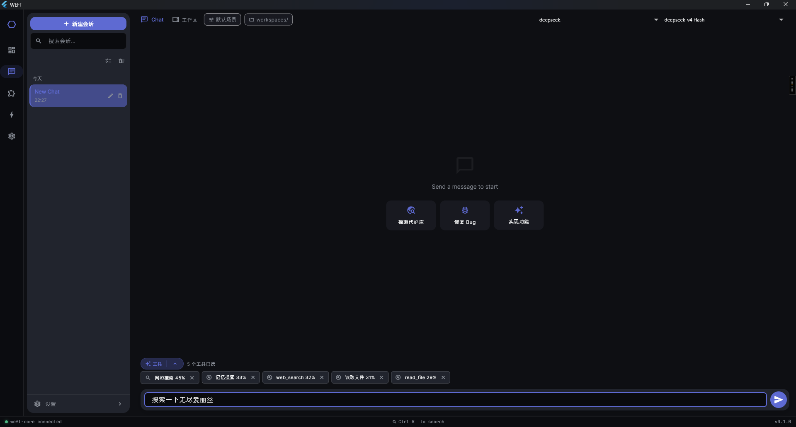
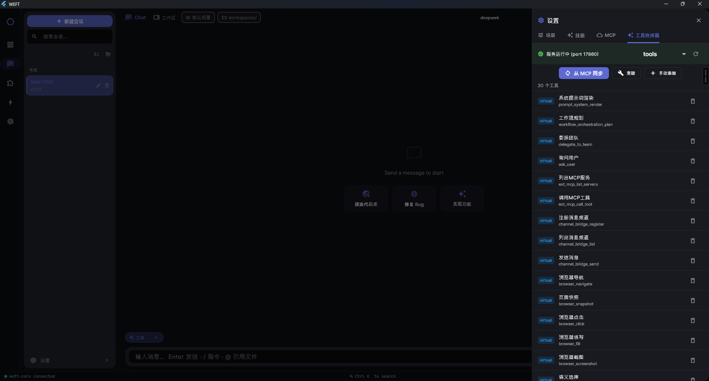
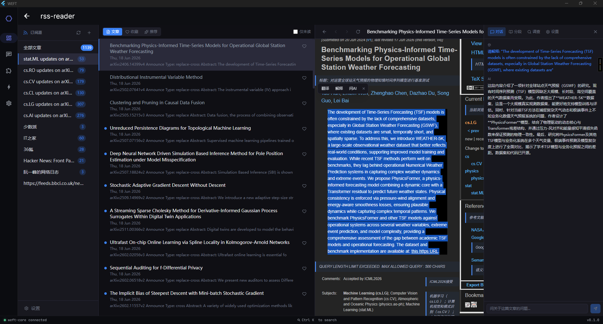
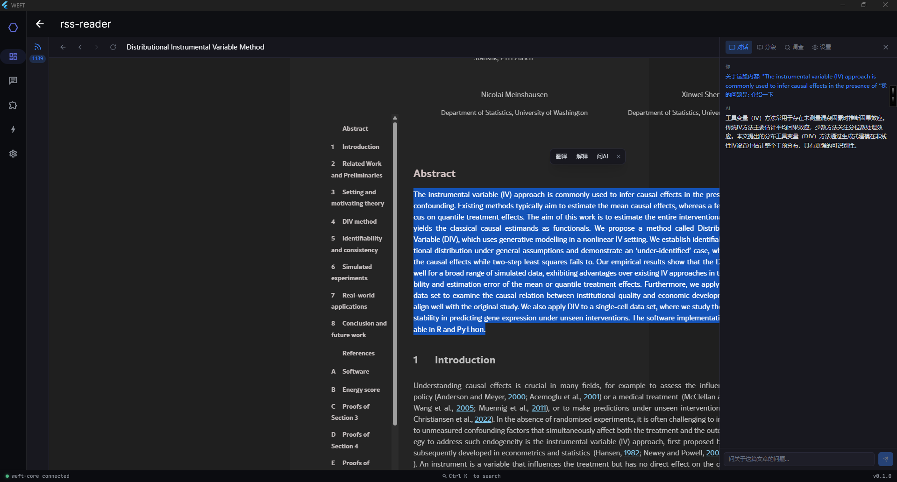
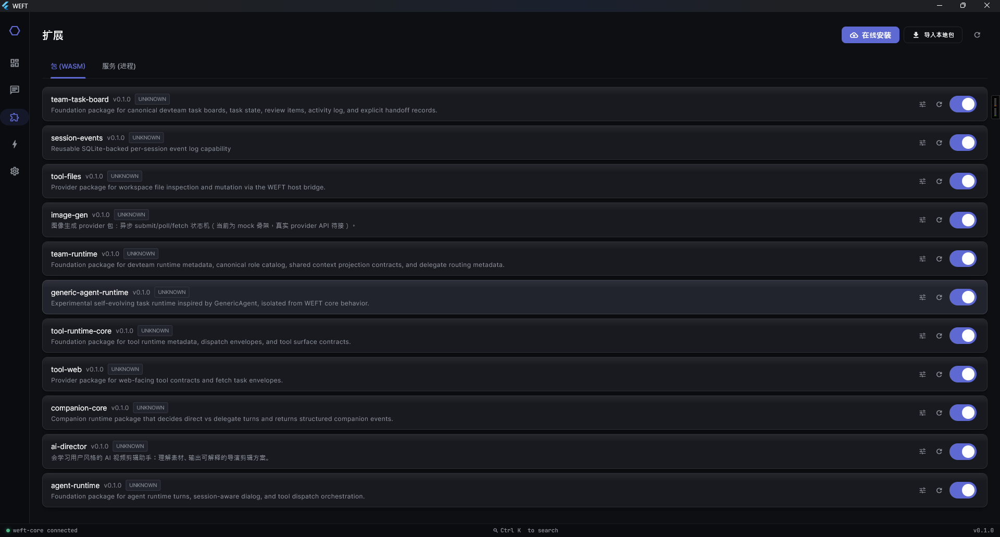
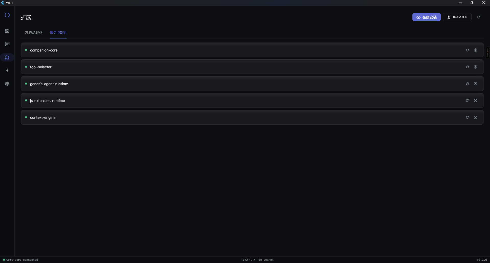

# Weft Features

A complete tour of everything Weft can do, screen by screen and capability by
capability. The desktop client is a Flutter app organized as an **app shell**
with a left navigation rail; every entry below maps to a real screen or a
package-delivered app surface.

> **Status: beta.** Weft is under active development. Features work but APIs,
> capability ids, and package layout can still change between versions, and some
> packages are earlier-stage than others. Expect rough edges.

- [Dashboard](#dashboard)
- [Chat](#chat)
- [Tool use & auto tool-selection](#tool-use--auto-tool-selection)
- [Multi-agent orchestration](#multi-agent-orchestration)
- [AI Director — the AI canvas](#ai-director--the-ai-canvas)
- [RSS reader](#rss-reader)
- [Package manager](#package-manager)
- [Resident service manager](#resident-service-manager)
- [Providers](#providers)
- [Settings](#settings)
- [App surfaces](#app-surfaces)
- [Capabilities reference](#capabilities-reference)

---

## Dashboard

The landing screen and operational home base. It shows, at a glance:

- **Connection status** — a live indicator for whether `weft-core` is reachable
  on its loopback port, with last-checked time and an inline retry. If the core
  is down you get an explicit offline banner instead of silent failures.
- **At-a-glance stats** — animated counters for the number of **Apps**,
  **Packages** (with how many are enabled), and **Providers** configured.
- **App launcher** — every app the core has resolved is listed as a card with
  its status dot (ok / partial / degraded / error), version, and description.
  Apps that ship a UI surface can be opened directly; headless apps are shown
  dimmed and can still be inspected for diagnostics. Any app can be **pinned**
  to the sidebar for quick access.
- **First-run guidance** — if no provider is configured yet, a get-started
  banner routes you straight to provider setup, because Weft needs at least one
  LLM provider and key before you can chat.

---

## Chat

A full conversational workspace backed by the core's OpenAI-compatible API.

- **Multi-session** — sessions are created and persisted automatically; the
  client opens or restores an active session on launch, so conversations
  survive restarts.
- **Streaming responses** — assistant output streams token-by-token over SSE,
  with a live typing cursor.
- **Markdown rendering** — replies render as rich Markdown (code blocks, lists,
  tables) rather than raw text.
- **Workspace & artifacts panel** — a side panel surfaces artifacts produced
  during the conversation (generated files, structured outputs), keeping
  long-lived results separate from the message stream.
- **Provider/model aware** — chat talks to whatever providers and models the
  core exposes, so switching backends needs no client changes.

---

## Tool use & auto tool-selection

Weft agents don't just talk — they act. Built-in tool packages expose a uniform
tool-runtime contract to the model:

- **Shell** (`tool.shell`) — run commands (execution is dry-run gated at the
  core for safety).
- **Files** (`tool.files`) — read and write workspace files.
- **Web** (`tool.web`) — fetch and search the web.
- **Git** (`tool.git`) — repository operations.
- **Browser** (`tool.browser`) — browser automation
  (navigate / snapshot / click / fill / screenshot) by bridging
  `chrome-devtools-mcp` over a long-lived MCP stdio session.

The **tool selector** lets you see and control which tools are available to a
turn. During chat, Weft can **automatically select the right tool** for the
task at hand — the model is offered the registered tools and picks what it needs
mid-turn, so a single message can trigger a web fetch, a file write, and a shell
command without you wiring anything up manually. Additional tools arrive by
installing packages or registering MCP servers (see below).

**How auto-selection works.** When the candidate tool set is large, picking is
backed by a dedicated **`tool-selector`** package — a semantic selector that
runs cosine-similarity matching over candidate libraries using ONNX INT8
inference. It runs as a local service (default `127.0.0.1:17860`), needs no GPU,
and returns a ranked shortlist in roughly 5–50 ms per query, so the model is
offered the most relevant tools rather than the entire catalog. The same engine
can be reused for asset selection and model routing.

**In-chat tool bubbles.** Tool calls render as purpose-built bubbles in the
conversation — shell commands, file reads/writes, and web searches each get a
tailored display — while any unregistered or MCP tool (`mcp:server:tool`) falls
back to a generic, human-readable rendering. This is opt-in by design: tools get
a rich bubble only when it adds value, everything else still shows cleanly.

---

## Multi-agent orchestration

The orchestration screen turns a single goal into a coordinated **team of
agents** working a dependency graph.

- **Goal in, plan out** — you type a high-level goal; the workflow orchestrator
  proposes a plan and fans it out into parallel sub-tasks.
- **`depends_on` DAG** — sub-tasks form a directed acyclic graph; independent
  branches run in parallel while dependent steps wait for their inputs. The
  screen renders the DAG plus a phase pipeline so you can watch progress.
- **Role-based agents** — tasks are delegated to role-specialized agents
  (planner, executor, reviewer, …) defined by the team-runtime's role catalog,
  with shared context across the team.
- **Live streaming** — each agent's output streams back into the UI as it works.
- **Verification & handoff** — the orchestrator verifies step results and the
  task board coordinates cross-role handoffs.
- **Self-delegation & user prompts** — agents can break large tasks down
  further on their own, and can pause to ask you to choose between options
  mid-turn.

This is the same machinery products like `weft-claw` are assembled from:
agent-runtime + team-runtime + workflow-orchestrator + tools + memory, bound
together declaratively.

---

## AI Director — the AI canvas

A style-learning AI **video-editing** assistant built as a product on top of the
runtime, presented as an **infinite canvas**.

- **AI-generated canvas DAG** — instead of a linear timeline, the Director lays
  work out as nodes on an infinite, pannable/zoomable canvas. The AI
  **automatically generates the node graph** (shots, edits, dependencies) for
  your project, drawing the edges between related steps.
- **Node-based shots** — each canvas node represents a shot or operation; a shot
  library panel feeds reusable pieces into the graph.
- **Director chat** — a dedicated chat panel drives the canvas conversationally:
  describe the edit you want and the Director plans and updates the graph.
- **Timeline view** — a timeline painter complements the canvas for fine-grained
  sequencing.
- **Media backends** — backed by an `ffmpeg-runtime` (video render) and
  `image-gen` (image generation) packages, plus a creative role catalog and
  creative workflow template.

---

## RSS reader

A built-in feed reader app surface for staying on top of sources — including a
"papers" view tuned for reading research.

Beyond plain reading, it's AI-augmented:

- **Inline translation** — translate an article into your language in place,
  so foreign-language sources and papers are readable without leaving the app.
- **Select-to-ask-AI** — highlight any passage and ask the AI about it directly
  (explain this, summarize, what does this term mean), turning the reader into a
  research assistant rather than a passive feed.

---

## Package manager

Everything Weft can do beyond raw LLM routing is delivered as a **package**, and
this screen manages them.

- **Browse installed packages** — see every package, whether it's enabled, and
  what it provides.
- **Online install** — install packages from a remote source.
- **Import local package** — bring in a package from disk.
- **Per-package configuration** — open a config dialog to adjust a package's
  settings.
- **Enable / disable** — toggle packages without uninstalling them.

Packages can be WASM (sandboxed via Extism), native, or embedded, and they
declare the capabilities they provide in `packages/index.toml` — the source
authority the core reads at startup.

---

## Resident service manager

Some packages run as long-lived **services** (for example the memory runtime,
context engine, or browser surface) rather than per-call WASM. This screen is
their control panel:

- **List services** managed by the core with their current state.
- **Start / stop / restart** each service individually.
- Live refresh of service status.

This makes the "always-on" parts of Weft — persistent memory, background context
ingestion, scheduled jobs — observable and controllable from the UI.

---

## Providers

The provider configuration screen is where you connect Weft to LLM backends.

- **Multiple providers** — OpenAI, Anthropic, DeepSeek, OpenRouter, and any
  other OpenAI-compatible endpoint.
- **Key failover / rotation** — register multiple API keys per provider; the
  core rotates and fails over between them.
- **Model lists** — declare which models each provider exposes; they surface
  through `/v1/models` and become selectable in chat.
- **Pluggable routing** — the core's provider router picks a provider/key per
  request according to its routing strategy.

Real keys live in `config/config.toml`, which is gitignored — only the example
template is committed.

---

## Settings

Client-level preferences, including:

- **Animation toggles** — enable/disable entrance animations and other motion.
- **Visual options** — e.g. sparklines on dashboard stat cards.
- Other client behavior preferences that are read reactively across screens.

---

## App surfaces

Apps that ship a UI don't hard-code themselves into the client. The
`/apps/:name` route renders a **package surface**: the core tells the client
which apps exist and which provide a `ui.surface` capability, and the client
renders the matching surface (native-registered or package-driven). This is how
new product apps can appear in the launcher without changing the client binary.

---

## Capabilities reference

Under the hood, every feature above is a **capability** — a stable string id a
package provides and an app requires. The core resolves these at startup and
dispatches calls to the right package. The main families:

**Agent & orchestration**

| Package | Provides | Role |
|---|---|---|
| `agent-core` | `agent.runtime`, `team.delegate` | Agent turns, session-aware dialog, tool dispatch |
| `workflow-orchestrator` | `workflow.orchestration` | Task proposal, verification, DAG step orchestration |
| `team-runtime` | `team.runtime`, `team.role.catalog`, `team.context.shared` | Team roles, shared context, delegate routing |
| `team-task-board` | `team.taskboard`, `team.handoff` | Task board + cross-role handoff |
| `generic-agent-runtime` | `generic_agent.plan/run/verify/crystallize` | Experimental self-evolving task runtime |
| `workflow-template-devteam`, `workflow-template-creative` | workflow templates | Prebuilt team / creative workflows |

**Memory & context**

| Package | Provides | Role |
|---|---|---|
| `memory` / `memory-runtime` | `memory.store`, `memory.runtime`, `memory.curated` | Persistent curated memory across sessions |
| `context-engine` | `context.engine`, `context.ingest`, `context.match` | Ingests signals, proactively suggests skills |
| `prompt-system` | `prompt.system` | System-prompt management |
| `session-events` | `session.events` | Session lifecycle events |

**Tools & extension**

| Package | Provides | Role |
|---|---|---|
| `tool-runtime-core` | `tool.runtime` | Uniform tool dispatch contract |
| `tool-shell` / `tool-files` / `tool-web` / `tool-git` | `tool.shell/files/web/git` | Built-in tools |
| `tool-selector` | `tool.selector` | Semantic tool routing — ONNX INT8 cosine similarity, ~5–50ms/query, no GPU |
| `tool-browser` | `tool.browser` | Browser automation bridged over chrome-devtools-mcp |
| `skills` | `ext.skills`, `skills.evolution/governance/review/maintenance` | Skill discovery, loading, execution |
| `mcp-client` | `ext.mcp` | Register MCP servers, expose their tools |
| `js-extension-runtime` | `extension.runtime.js`, `skill.discovery` | Run JavaScript extensions |
| `channels` | `channel.bridge` | Channel bridge & routing |
| `cron` | `scheduler.cron`, `maintenance.tick` | Scheduled jobs & maintenance ticks |

**Products & media**

| Package | Provides | Role |
|---|---|---|
| `weft-claw` | `weft_claw.turn`, `ui.surface` | Multi-role AI development assistant (product) |
| `ai-director` | `director.plan`, `director.turn` | Style-learning AI video-editing assistant (product) |
| `rss-reader` | `rss.reader` | AI-augmented feed reader (subscribe, fetch, parse, summarize) |
| `ffmpeg-runtime` | `video.render` | Video rendering backend |
| `image-gen` | `image.generate` | Image generation |
| `ai-workspace-browser` | `browser.window`, `browser.tabs`, `browser.context.dom`, … | Embedded workspace browser with grounded actions |
| `creative-role-catalog` | `team.role.catalog` | Creative team roles |

> Capabilities the **core itself** provides (not a package) include
> `core.execution` (command execution, dry-run gated) and `core.files`
> (workspace file access).

For how these layers fit together, see [ARCHITECTURE.md](ARCHITECTURE.md).
